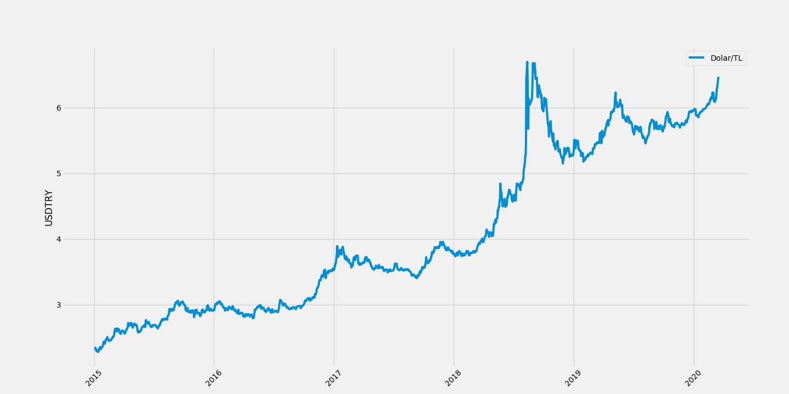

# dolarKuru
 plot_usdTRY.py: Dolar kurunu bir internet servisinden çekerek 01.01.2015 tarihinden bugüne çizmektedir.
usdTRY_toCSV.py: Dolar kurunu bir internet servisinden çekerek 01.01.2015 tarihinden bugüne kadar olan verileri csv formatında yazmaktadır. Açılış, kapanış, gün yüksek ve gün düşük değerlerini içerir.

Örnek bir çıktı

